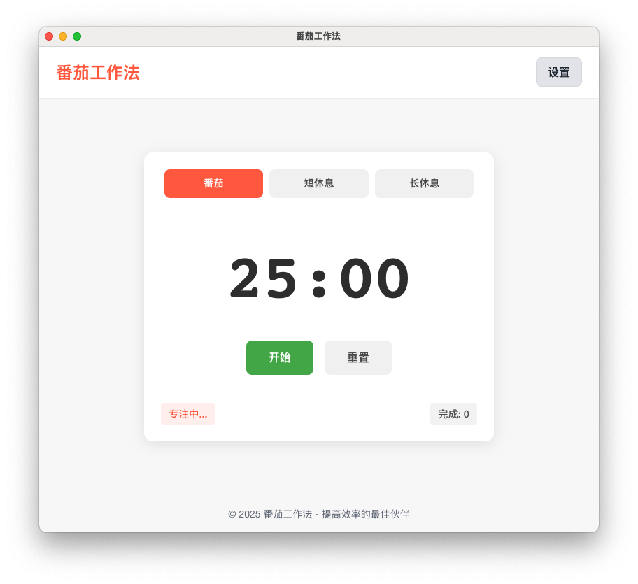
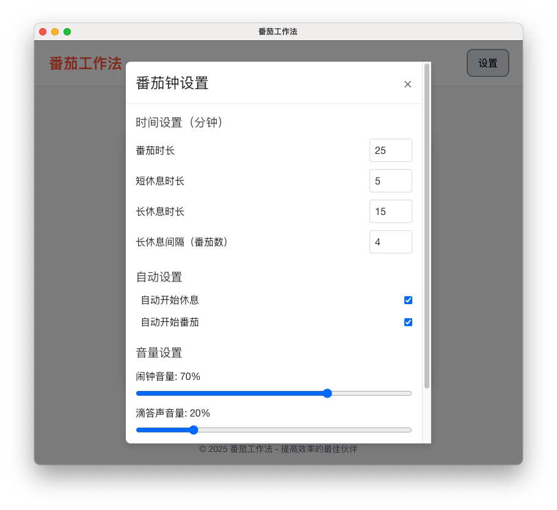

# MyPomodoro 番茄工作法应用

一个基于Electron的强大番茄工作法计时应用，帮助你提高工作和学习效率。




## 功能特点

- 🍅 高度可定制的番茄工作时长、短休息和长休息时间
- 🔄 自动切换工作和休息状态
- 🔊 可调节音量的滴答声和闹铃提示
- 🔔 桌面系统通知
- 📊 工作周期进度显示
- 🌙 自适应亮色/暗色模式
- 💾 本地存储保存您的设置
- 📱 响应式设计，适合不同窗口大小
- 🔄 系统托盘支持，关闭窗口时最小化到托盘

## 下载安装

访问 [Releases](https://github.com/yourusername/MyPomodoro/releases) 页面下载最新版本的安装包：

- Windows: `.exe` 安装文件
- macOS: `.dmg` 安装文件
- Linux: `.AppImage` 或 `.deb` 安装文件

## 开发技术

- Electron 桌面应用框架
- React + Vite 前端框架
- TailwindCSS 样式库
- LocalStorage 数据持久化

## 本地开发

```bash
# 克隆仓库
git clone https://github.com/yourusername/MyPomodoro.git
cd MyPomodoro

# 安装依赖
npm install

# 启动前端开发服务器
npm run dev

# 启动Electron应用 (开发模式)
npm run electron:dev

# 构建桌面应用
npm run electron:build
```

## 关于音频文件

需要在 `public` 目录中放置以下音频文件：
- `alarm.mp3` - 计时结束提醒音效
- `ticking.mp3` - 滴答声音效

## 项目结构

```
MyPomodoro/
├── electron/           # Electron 主进程代码
├── src/                # React 前端代码
│   ├── components/     # React 组件
│   ├── hooks/          # 自定义 React Hooks
│   └── App.jsx         # 主应用组件
├── public/             # 静态资源
├── dist/               # 构建输出目录
└── release/            # 打包输出目录
```

## 贡献指南

1. Fork 此仓库
2. 创建你的特性分支 (`git checkout -b feature/amazing-feature`)
3. 提交你的修改 (`git commit -m 'Add some amazing feature'`)
4. 推送到分支 (`git push origin feature/amazing-feature`)
5. 打开一个 Pull Request

## 问题反馈

如发现任何问题，请在 [Issues](https://github.com/zj05409/MyPomodoro/issues) 页面提交。

## 许可证

本项目采用 MIT 许可证 - 详情请参阅 [LICENSE](LICENSE) 文件。

## 致谢

- 感谢所有开源项目的贡献者
- 图标来源: [Flaticon](https://www.flaticon.com/) 
